

  <a href="https://hest.si">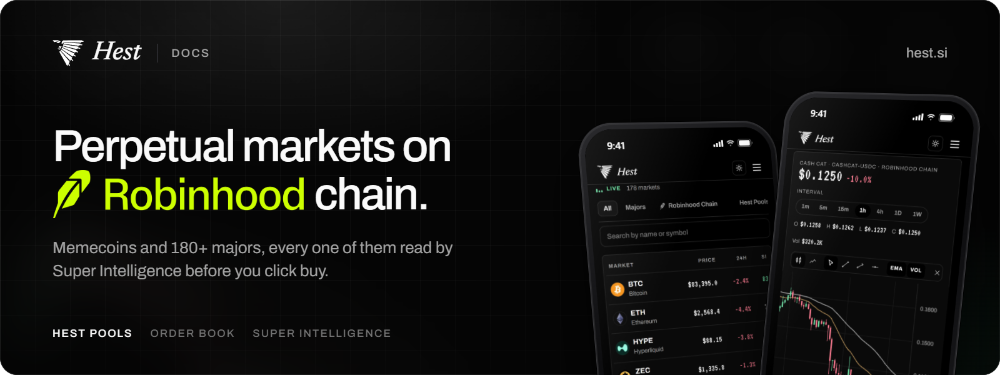</a>

  <a href="https://hest.si">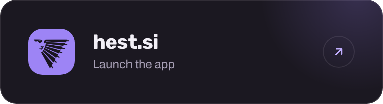</a>
  <a href="https://x.com/HestSI">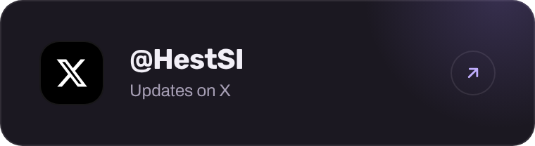</a>
  <a href="https://discord.gg/hest">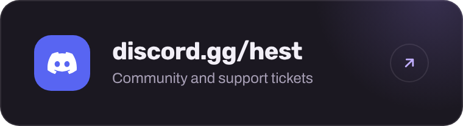</a>
  <a href="https://hest.gitbook.io">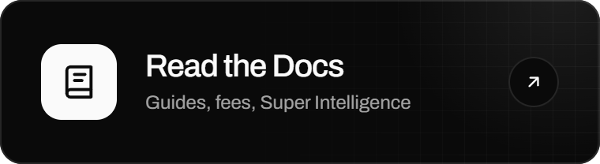</a>

 

**Hest** is a perpetuals exchange built around one idea: the market should be read before the order is placed. Majors trade on a deep order book, fresh Robinhood Chain memecoins trade against community-funded vaults, and every market is scored by **Super Intelligence** before you click buy.

This repository is the source of the Hest documentation. It is published with GitBook and every page is a plain Markdown file, so fixes and additions arrive as pull requests.

 

Risk Shield: the worst hour of the week against your liquidation distance, before you click buy. Recorded on the Beta build with test data.

 

<a href="docs/connect-a-wallet.md">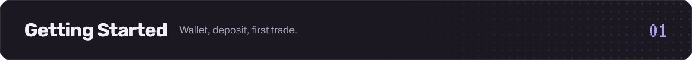</a>

[Connect a Wallet](docs/connect-a-wallet.md) · [Deposit USDC](docs/deposit.md) · [Your First Trade](docs/first-trade.md)

<a href="docs/order-book-markets.md">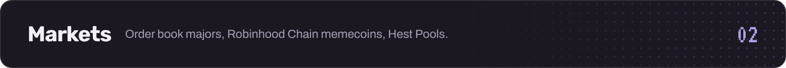</a>

[Order Book Markets](docs/order-book-markets.md) · [Hest Pools](docs/hest-pools.md) · [Open a Market](docs/open-a-market.md)

<a href="docs/si-score.md">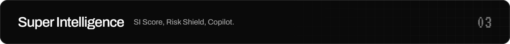</a>

[SI Score](docs/si-score.md) · [Risk Shield](docs/risk-shield.md) · [Copilot](docs/copilot.md)

<a href="docs/order-types.md">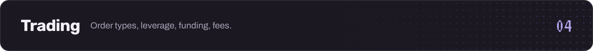</a>

[Order Types](docs/order-types.md) · [Leverage and Liquidation](docs/leverage-and-liquidation.md) · [Funding](docs/funding.md) · [Fees](docs/fees.md)

<a href="docs/how-vaults-earn.md">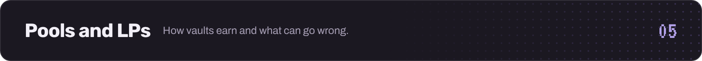</a>

[How Vaults Earn](docs/how-vaults-earn.md) · [Vault Risks](docs/vault-risks.md)

<a href="docs/faq.md">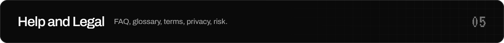</a>

[FAQ](docs/faq.md) · [Glossary](docs/glossary.md) · [Terms of Service](docs/terms.md) · [Privacy Policy](docs/privacy.md) · [Risk Disclosure](docs/risk-disclosure.md)

 

## Contributing

Found a mistake or something missing? Open an issue or send a pull request. Keep the voice of the existing pages: short, direct, numbers over adjectives. Super Intelligence, SI Score, Risk Shield and Copilot are always written exactly like that. The published documentation lives in `docs/`: flat page files (`section-page.md`) listed in `docs/SUMMARY.md`, with `docs/README.md` as the landing page.

## Status

Hest is in **Beta** on mainnet. Markets, fees and limits described here can change; the documentation is updated with every release. Documentation videos are recorded in Pacific Time (Seattle).

  © 2026 Hest Super Intelligence · <a href="https://hest.si">hest.si</a> · <a href="https://x.com/HestSI">X</a> · <a href="https://discord.gg/hest">Discord</a>

