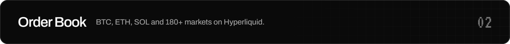
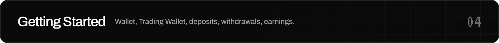

  

  
  
  
  

 

**Hest** is a perpetuals exchange for Robinhood Chain memecoins and 180+ majors. Robinhood Chain memecoins that Hyperliquid does not list trade on **Hest Pools**, priced on their own Uniswap pools with Hest as the counterparty. BTC, ETH, SOL and 180+ more trade on Hyperliquid's order book. Every market is read by **Super Intelligence** before you click buy.

This repository is the source of the Hest documentation. It is published with GitBook, and every page is a plain Markdown file, so fixes and additions arrive as pull requests.

 

Risk Shield: your liquidation distance against the worst hour of the week, before you click buy. Recorded on the live interface.

 

[Hest Pools](docs/hest-pools.md) · [How Hest Pools Work](docs/how-hest-pools-work.md) · [Hest Pools Pricing](docs/hest-pools-pricing.md) · [Open a Market](docs/open-a-market.md) · [Hest Pools Risks](docs/hest-pools-risks.md)

[Order Book Markets](docs/order-book-markets.md) · [Order Types](docs/order-types.md) · [Leverage and Liquidation](docs/leverage-and-liquidation.md) · [Funding](docs/funding.md) · [Fees](docs/fees.md)

[SI Score](docs/si-score.md) · [Risk Shield](docs/risk-shield.md) · [Copilot](docs/copilot.md)

[Connect a Wallet](docs/connect-a-wallet.md) · [Hest Trading Wallet](docs/trading-wallet.md) · [Deposit](docs/deposit.md) · [Your First Trade](docs/first-trade.md) · [Withdraw](docs/withdraw.md) · [Earnings](docs/earnings.md)

[FAQ](docs/faq.md) · [Glossary](docs/glossary.md) · [Security](docs/security.md) · [Risk Disclosure](docs/risk-disclosure.md) · [Terms of Service](docs/terms.md) · [Privacy Policy](docs/privacy.md)

 

## No Token

Hest has no token. Anything claiming to be a Hest token without an official announcement on [hest.si](https://hest.si) and [@HestSI](https://x.com/HestSI) is fake.

## Contributing

Found a mistake or something missing? Open an issue or send a pull request. Keep the voice of the existing pages: short, direct, numbers over adjectives. Super Intelligence, SI Score, Risk Shield and Copilot are always written exactly like that. The published documentation lives in `docs/`: one Markdown file per page, listed in `docs/SUMMARY.md`, with `docs/README.md` as the landing page.

## Status

Hest is in **Beta** on mainnet. Markets, fees and limits described here can change; the documentation is updated with every release. Times in the app are shown in your own time zone; official dates are announced in Pacific Time.

  © 2026 Hest Super Intelligence · <a href="https://hest.si">hest.si</a> · <a href="https://x.com/HestSI">X</a> · <a href="https://discord.gg/hest">Discord</a> · legal@hest.si

