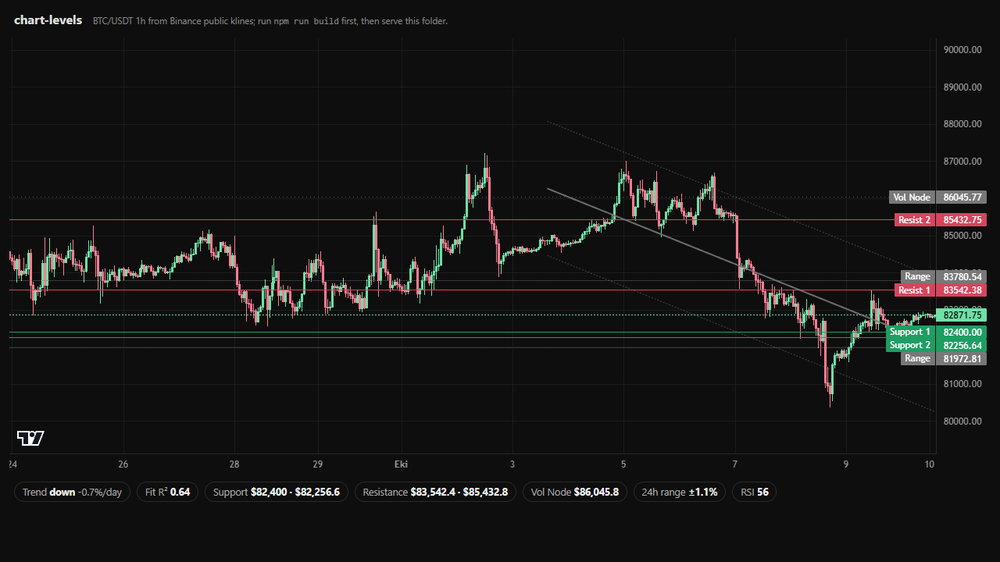

# Welcome to Hest

Hest is a perpetuals exchange for **Robinhood Chain memecoins and 180+ majors**. Every market is read by **Super Intelligence** before you trade.

* **Hest Pools:** perpetual markets on the Robinhood Chain memecoins Hyperliquid does not list. Hest is the counterparty, the price comes from the token's own Uniswap pool on Robinhood Chain, collateral is WETH, leverage up to 5x.
* **Order Book:** BTC, ETH, SOL and 180+ more on Hyperliquid's order book, plus the Robinhood Chain tokens Hyperliquid lists (today CASHCAT and PONS). Collateral is USDC.
* **Super Intelligence:** every market gets an SI Score, every order gets a Risk Shield verdict, and Copilot answers your questions with the live numbers.


Hest is in **Beta** on mainnet. Markets, fees and limits described here can change; this documentation is updated with every release.



**Hest has no token.** Anything claiming to be a Hest token without an official announcement on [hest.si](https://hest.si) and [@HestSI](https://x.com/HestSI) is fake.


## How Hest Fits Together

| Layer                  | What it is                                                                                                                               | Where it lives                                    |
| ---------------------- | ---------------------------------------------------------------------------------------------------------------------------------------- | ------------------------------------------------- |
| **Connected wallet**   | Your own wallet. Signs you in; receives every withdrawal.                                                                                | Your wallet app                                   |
| **Trading Wallet**     | A wallet Hest creates for you. Holds your trading funds; Hest signs your trades with it.                                                 | One address on Robinhood Chain and on Hyperliquid |
| **Hest Pools**         | Hest-backed perpetuals on Robinhood Chain memecoins, priced on-chain from Uniswap v3 pools and settled in WETH by the Hest Pools engine. | Robinhood Chain                                   |
| **Order Book**         | Perpetuals executed, margined and settled by Hyperliquid, from your Trading Wallet's Hyperliquid account.                                | Hyperliquid                                       |
| **Super Intelligence** | SI Score, Risk Shield and Copilot, computed from live market data.                                                                       | The Hest interface                                |

Deposits reach your Trading Wallet from eight networks through Relay, and withdrawals only ever go back to the wallet you signed in with.

## Start Here

1. [Connect a Wallet](getting-started/connect-a-wallet.md): sign in with a gas-free signature, or with Google.
2. [Hest Trading Wallet](getting-started/trading-wallet.md): create it and save its key.
3. [Deposit](getting-started/deposit.md): fund the Hest Pools side, the Order Book side, or both.
4. [Your First Trade](getting-started/first-trade.md): from the market list to an open position.

## Go Deeper

* **Hest Pools:** [How Hest Pools Work](markets/how-hest-pools-work.md), [Hest Pools Pricing](markets/hest-pools-pricing.md), [Open a Market](markets/open-a-market.md), [Hest Pools Risks](markets/hest-pools-risks.md).
* **Trading:** [Order Types](trading/order-types.md), [Leverage and Liquidation](trading/leverage-and-liquidation.md), [Funding](trading/funding.md), [Fees](trading/fees.md).
* **Super Intelligence:** [SI Score](super-intelligence/si-score.md), [Risk Shield](super-intelligence/risk-shield.md), [Copilot](super-intelligence/copilot.md).
* **Your account:** [Withdraw](getting-started/withdraw.md), [Earnings](getting-started/earnings.md), [Security](help/security.md).

## Key Numbers

|                    | Hest Pools                                     | Order Book                                  |
| ------------------ | ---------------------------------------------- | ------------------------------------------- |
| Collateral         | WETH                                           | USDC                                        |
| Maximum leverage   | 5x                                             | Per market, set by Hyperliquid (40x on BTC) |
| Trading fee        | 0.30% open, 0.30% close                        | Hyperliquid's fee + 0.05%                   |
| Maintenance margin | 6%                                             | `1 / (2 × max leverage)`                    |
| Funding            | None                                           | Hourly                                      |
| Profit             | Earnings, locked 7 days, then paid             | Immediate, on Hyperliquid                   |
| Deposit fee        | 0.8% (none for ETH already on Robinhood Chain) | 0.8%                                        |
| Withdrawal fee     | None                                           | None (Hyperliquid charges 1 USDC)           |

## Times

Times in the app are shown in your own time zone. Official dates (launches, programmes, deadlines) are announced in Pacific Time.

## Links

* App: [hest.si](https://hest.si)
* X: [@HestSI](https://x.com/HestSI)
* Discord: [discord.gg/hest](https://discord.gg/hest) (support tickets)
* Legal: legal@hest.si

## From Our Developers

The math behind the SI Levels on Hest's charts is open source. [**chart-levels**](https://github.com/hest-si/chart-levels) is a zero-dependency library that reads support and resistance, the best-fit trend channel, expected daily range, volume nodes and RSI divergence from raw candles, with a one-call adapter for TradingView Lightweight Charts.

Use it, audit it, star it: [github.com/hest-si/chart-levels](https://github.com/hest-si/chart-levels).
