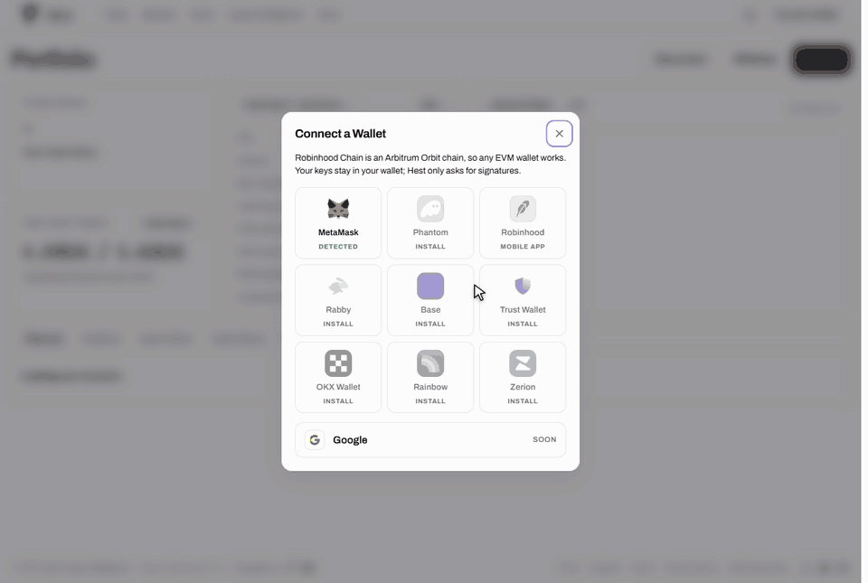

# Deposit

Every deposit goes into your [Trading Wallet](trading-wallet.md). You choose which side it is for, Hest gives you a one-time deposit address, and you send from almost any wallet or exchange. Deposits are routed by **Relay**, which swaps and bridges the funds and delivers them to the right place.

## Where a Deposit Arrives

| Side | Arrives as | Where |
| --- | --- | --- |
| **Hest Pools** | ETH | Your Trading Wallet on Robinhood Chain. ETH is wrapped to WETH automatically when you open a position, and part of it pays network fees. |
| **Order Book** | USDC | Your Trading Wallet's Hyperliquid account, ready to trade. Hyperliquid keeps 1 USDC once to activate a new account. |

## How to Deposit

1. Connect your wallet and sign in. Create your Trading Wallet and confirm that you saved its key; deposits unlock after that confirmation.
2. Click **Deposit** (in Portfolio, or in the wallet menu at the top right).
3. Choose the side: **Hest Pools** or **Order Book**.
4. Pick **Send From** (the network you are sending from) and the **Token**, and enter the amount.
5. Click **Get Deposit Address**. Hest asks Relay for a route and shows the full breakdown: **You Send**, **Hest Fee (0.8%)**, **Network and Bridge Fees**, **You Receive** and **Arrives In**, with the deposit address and its QR code.
6. Send exactly that token, on exactly that network, to the address, from any wallet or exchange. On EVM networks you can instead click **Send from Connected Wallet**: your wallet switches to the right network (adding Robinhood Chain if it does not know it) and asks you to approve the transfer.
7. The dialog follows the transfer: **Waiting for your transfer**, then **Transfer received, delivering to your Trading Wallet**, then **Arrived** with a link to the delivery transaction. It keeps following it if you close the dialog, and the deposit is also listed under **Deposits and Withdrawals** in Portfolio.

The quote for the last deposit address stays in the dialog for 30 minutes, so you can reopen it and copy the address again.

## Supported Networks and Tokens

| Send from | Tokens |
| --- | --- |
| Arbitrum | ETH, USDC, USDT |
| Ethereum | ETH, USDC, USDT |
| Base | ETH, USDC |
| Optimism | ETH, USDC |
| BNB Chain | BNB, USDT, USDC |
| Polygon | USDC, USDT |
| Solana | SOL, USDC |
| Robinhood Chain | ETH, USDG |

Any of these can be sent to either side: Relay swaps it into ETH on Robinhood Chain for Hest Pools, or into USDC on Hyperliquid for the Order Book.


Send only the token and network shown for that deposit address. A token that is not on this list, or a token sent on the wrong network, cannot be recovered. Each deposit address is for one deposit only: get a new address for every deposit.


## Fees

| | Amount |
| --- | --- |
| Hest deposit fee | 0.8% of the amount you send |
| Relay fee and network fees | Depend on the route; quoted before you send |
| ETH already on Robinhood Chain, sent straight to your Trading Wallet for Hest Pools | No Hest fee, only the network fee |

**Example.** 500 USDC from Base to the Order Book side: the Hest fee is $4.00, and you receive about 496 USDC on Hyperliquid minus Relay's fee and network fees as quoted. On a first Order Book deposit, Hyperliquid keeps 1 USDC of that to activate the account.

## Already on Robinhood Chain

If you choose **Hest Pools** and **Robinhood Chain / ETH**, no deposit address is needed: the dialog shows your Trading Wallet address and QR code, and you send ETH to it directly with no Hest fee. Send only ETH on Robinhood Chain to that address.

USDG on Robinhood Chain goes through Relay like any other token and arrives as ETH.

## Sending From Solana

Relay can only refund a failed Solana deposit on Solana, so the dialog asks for **Your Solana Address**: the Solana wallet you are sending from. It is used only for refunds. **Send from Connected Wallet** is not available for Solana; send from your Solana wallet to the deposit address.

## If a Deposit Fails

If Relay cannot complete a deposit, it refunds it on the network you sent from:

* **EVM networks:** the refund goes to your **connected wallet address** on that network, even if you sent from an exchange.
* **Solana:** the refund goes to the Solana address you entered.

The dialog then shows **Refunded to your wallet** or **Deposit failed**. If you need help, open a ticket on [Discord](https://discord.gg/hest) with the deposit address.

## Keep Some ETH on Robinhood Chain

Every Hest Pools opening, market application and Robinhood Chain withdrawal is a transaction from your Trading Wallet, paid in ETH. About $1 of ETH covers hundreds of transactions. When ETH is wrapped for a position, a small reserve is always left unwrapped for these fees.
