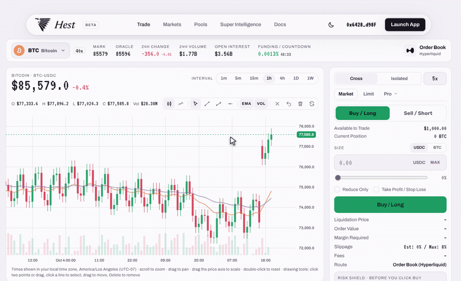

# Your First Trade

A trade on Hest takes a few decisions, and Super Intelligence checks the dangerous one before you confirm.

## 1. Pick a Market

Open **Markets**, or use the market picker at the top left of the trade page. Filters: **All**, **Majors**, **Robinhood Chain**, **Hest Pools**, **Other Memes**. Every row shows the price, 24h change, volume, open interest, hourly funding, maximum leverage, the SI Score and the route.

Make sure the side you are trading is funded: Order Book markets use the USDC in your Hyperliquid account, Hest Pools markets use the WETH in your Trading Wallet on Robinhood Chain. See [Deposit](deposit.md).

## 2. Read the Strip

Across the top of an Order Book market: **Mark** (the price your position is valued at), **Oracle** (the external reference price), 24h change, 24h volume, open interest, and **Funding / Countdown**. Times on the chart are shown in your own time zone.

## 3. Set the Order

In the order panel on the right:

* **Cross / Isolated** margin and the leverage control.
* **Market** or **Limit**; the **Pro** menu adds Stop Market, Stop Limit, TWAP and Scale.
* **Buy / Long** or **Sell / Short**.
* **Size** in USDC or in the coin, or drag the slider for a share of your available balance.
* Optional **Reduce Only** and **Take Profit / Stop Loss**.

Before you do anything, the panel shows the liquidation price, order value, margin required, estimated slippage, fees and the route.

## 4. Check Risk Shield

Below the order form, **Risk Shield** compares your liquidation distance with the worst 1-hour candle of the last 7 days and gives a verdict: room to breathe, tight, or one normal candle liquidates this. Ask **Copilot** right there: **Is this size safe?**, **Why this score?**, **Safer leverage?** See [Risk Shield](risk-shield.md).

## 5. Confirm

Click the big button and confirm. Hest signs the order with your Trading Wallet, so there is no wallet pop-up. Your position appears in the **Positions** tab under the chart with entry, mark, profit and loss, liquidation price and margin.

The other tabs keep the full record: Balances, Open Orders, TWAP, Trade History, Funding History, Order History.
