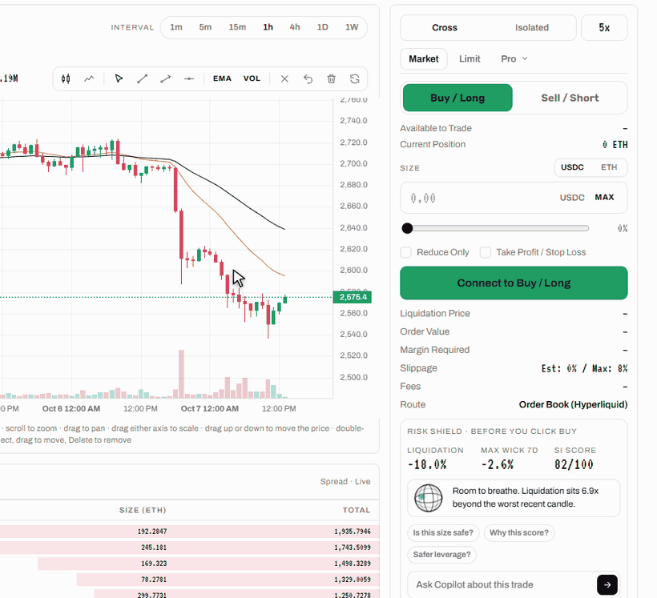

# Your First Trade

A trade on Hest takes a few decisions, and Super Intelligence checks the dangerous one before you confirm.

## 0. Be Ready to Trade

You need a signed-in wallet, a Trading Wallet whose key you saved, and funds on the right side:

| Market     | Funds needed                                                                               |
| ---------- | ------------------------------------------------------------------------------------------ |
| Order Book | USDC in your Trading Wallet's Hyperliquid account. See [Deposit](deposit.md).              |
| Hest Pools | ETH or WETH in your Trading Wallet on Robinhood Chain, plus a little ETH for network fees. |

If anything is missing, the order button says what (for example **Deposit USDC to Trade**) and opens a **Not Ready to Trade** checklist with a button for the next step: Sign In, Create, Finish or Deposit.

## 1. Pick a Market

Open **Markets**, or use the market picker at the top left of the trade page. Filters: **All**, **Majors**, **Robinhood Chain**, **Hest Pools**, **Other Memes**. Every row shows the price, 24h change, 24h volume, open interest, hourly funding, capacity (Hest Pools), maximum leverage, the SI Score and the route.

## 2. Read the Strip



Across the top of the trade page: **Mark** (the price your position is valued at), **Oracle** (the external reference price), 24h change, 24h volume, **Open Interest**, and **Funding / Countdown** (the hourly rate and the time to the next payment). Times on the chart are shown in your own time zone.



Across the top: **Mark** (here the pool's spot price), **TWAP 15m**, 24h change, 24h volume, **Open Interest / Capacity**, and **Pricing: Worse of Spot / TWAP**. In place of the order book, a panel shows Spot, TWAP 15m, Capacity, DEX Liquidity and how much of each side is used, plus a notice if the market is paused.



## 3. Set the Order

In the order panel on the right:

* **Cross / Isolated** margin and the leverage control (Order Book). Hest Pools positions are always isolated.
* **Market** or **Limit**; the **Pro** menu adds Stop Market, Stop Limit, TWAP and Scale (Order Book only). Hest Pools take market orders.
* **Buy / Long** or **Sell / Short**.
* **Size** in USDC or in the coin, or drag the slider for a share of your available balance.
* Optional **Reduce Only** and **Take Profit / Stop Loss**.

Before you confirm, the panel shows the **Liquidation Price**, **Order Value**, **Margin Required**, **Slippage** (estimate and maximum), **Fees** and the **Route**. See [Order Types](../trading/order-types.md).

## 4. Check Risk Shield

Below the order form, **Risk Shield** compares your liquidation distance with the worst 1-hour candle of the last 7 days and gives a verdict: **Room to breathe**, **Tight**, or **One normal candle liquidates this**. Ask **Copilot** right there: **Is my order safe?**, **What leverage fits?**, **What could go wrong?** See [Risk Shield](../super-intelligence/risk-shield.md).

## 5. Confirm

Click the big button. A confirmation dialog repeats the order and the Risk Shield verdict; confirm it.



Hest signs the order with your Trading Wallet and your browser sends it to Hyperliquid, so there is no wallet pop-up. Your first order also carries the one-time builder fee approval. The position appears in the **Positions** tab with size, entry, mark, profit and loss, liquidation price and margin.

The other tabs keep the full record: **Balances**, **Open Orders**, **TWAP**, **Trade History**, **Funding History**, **Order History**.



Your margin plus the 0.30% opening fee moves in WETH from your Trading Wallet to the Hest Pools collateral wallet (ETH is wrapped first if needed), and the position opens at the worse of spot and TWAP. It appears in the **Positions** tab within seconds. Close it from there; what is left of your collateral returns at once and any profit goes to [Earnings](earnings.md). See [How Hest Pools Work](../markets/how-hest-pools-work.md).



## 6. Follow It in Portfolio

**Portfolio** in the top menu shows your total equity on both sides, positions on both venues, open orders, trade history, funding, **Earnings** and **Deposits and Withdrawals**, with account value and profit and loss over 1D, 7D, 30D or All.
