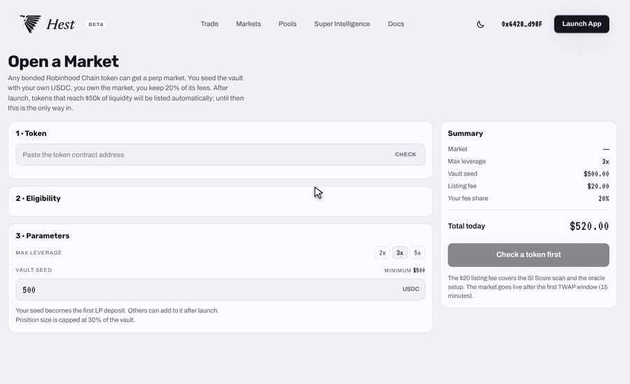

# Open a Market

Any bonded Robinhood Chain token can get a perpetual market on Hest. During the Beta this is the only way a new pool market appears: the community opens it.

## Who Can Open One

Anyone with a connected wallet and at least **$500 USDC** for the vault seed.

## Eligibility

Paste the token's contract address on the **Open a Market** page and click **Check**. Super Intelligence reads the token and shows four checks:

1. **Bonded on the launchpad** – the token has graduated from its bonding curve to the DEX.
2. **$50k+ DEX liquidity** – enough depth for a TWAP that cannot be pushed cheaply.
3. **24 hours old** – no same-block launches.
4. **SI Score 45+** – below 45 the token does not list. Between 45 and 60 it lists with leverage capped at 2x.

## What You Choose

* **Max leverage**: 2x, 3x or 5x (capped by the SI Score).
* **Vault seed**: your USDC, minimum $500. It becomes the first LP deposit; others can add to the vault after launch.

## What You Pay and What You Earn

* **Listing fee**: $20, covering the SI scan and the oracle setup.
* **Your fee share**: 20% of every trading fee on that market, for as long as the market exists. Vault depositors (including you, through your seed) earn another 70%.

## Timeline

Confirm, pay seed + fee, and the market goes live after the first 15-minute TWAP window. It shows up in Markets under **Hest Pools** and in the Pools page with your vault.


A vault seed is leveraged exposure to the traders of that market, not a deposit. If traders on your market win, the vault, and your seed, lose. Read [Vault Risks](pools-vault-risks.md) first.

