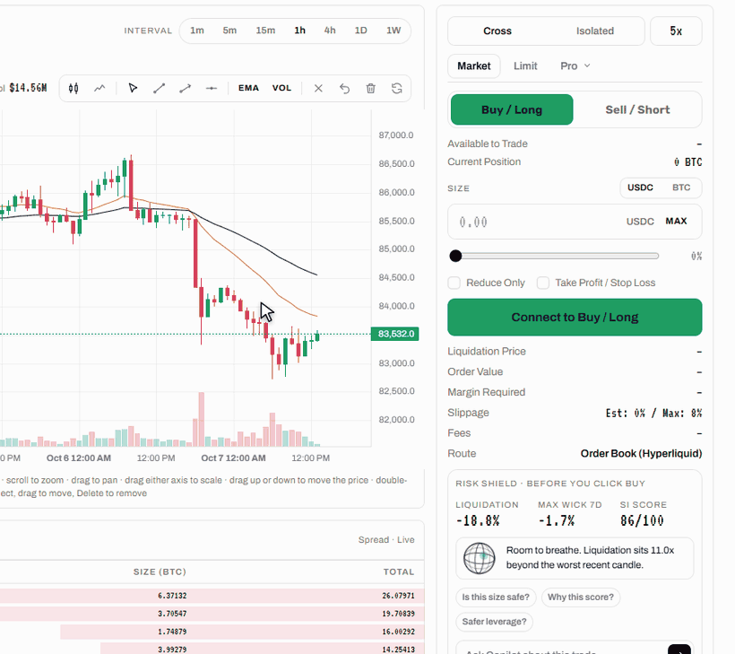

# Risk Shield

Risk Shield is the check that runs **before you click buy**, on every trade page, under the order form. It answers one question: *would a normal bad hour in this market liquidate this position?* It updates live as you change leverage, side or market, and its verdict is repeated in the confirmation dialog before anything is signed.



## The Calculation

1. **Liquidation distance**, in percent of price:

   ```
   liquidation distance = 100 / leverage − maintenance margin %
   ```

   The maintenance margin is `1 / (2 × max leverage)` on Order Book markets (1.25% on BTC at 40x) and 6% on Hest Pools markets.
2. **Worst candle:** the largest 1-hour candle of the last 7 days in this market, shown as **Max Wick 7d**. See [SI Score](si-score.md#the-worst-candle) for exactly how it is measured.
3. **Ratio** = liquidation distance ÷ worst candle.

## The Verdict

| Ratio | Verdict | Mascot |
| --- | --- | --- |
| under 1.0 | **One normal candle liquidates this.** A move the market already made this week would take the position out. | Scared |
| 1.0 to 1.5 | **Tight.** You survive the worst candle of the week, with little to spare. The readout shows how many percentage points remain. | Worried |
| 1.5 and above | **Room to breathe.** Liquidation sits comfortably beyond anything the market did this week. The readout shows the ratio. | Happy |

The readout also shows the **Liquidation** distance, the **Max Wick 7d** and the market's **SI Score**, so you see market quality next to position risk.

## Safer Leverage

The highest whole leverage that still has **room to breathe** (ratio of at least 1.5) is:

```
safer leverage = floor(100 / (1.5 × worst candle + maintenance margin %))
```

capped at the market's maximum. Copilot uses this number when you ask what leverage fits.

## Worked Examples



Maximum leverage 40x, so maintenance margin is 1.25%. Suppose the worst 1-hour candle of the week was 2.4%.

| Leverage | Liquidation distance | Ratio | Verdict |
| --- | --- | --- | --- |
| 40x | 2.5 − 1.25 = 1.25% | 0.52 | One normal candle liquidates this |
| 25x | 4 − 1.25 = 2.75% | 1.15 | Tight |
| 20x | 5 − 1.25 = 3.75% | 1.56 | Room to breathe |
| 10x | 10 − 1.25 = 8.75% | 3.65 | Room to breathe |

Safer leverage: floor(100 / (1.5 × 2.4 + 1.25)) = floor(20.6) = **20x**.



Maintenance margin is 6%. Suppose the worst 1-hour candle of the week was 18%.

| Leverage | Liquidation distance | Ratio | Verdict |
| --- | --- | --- | --- |
| 5x | 20 − 6 = 14% | 0.78 | One normal candle liquidates this |
| 4x | 25 − 6 = 19% | 1.06 | Tight |
| 3x | 33.33 − 6 = 27.33% | 1.52 | Room to breathe |
| 2x | 50 − 6 = 44% | 2.44 | Room to breathe |

Safer leverage: floor(100 / (1.5 × 18 + 6)) = floor(3.03) = **3x**.



## Ask Before You Trade

Under the verdict, Copilot takes questions about the order you are drafting, with the side, leverage and size you have entered: **Is my order safe?**, **What leverage fits?**, **What could go wrong?**, or anything you type. See [Copilot](copilot.md).

## What It Does Not Do

* Risk Shield does **not block orders**. It informs; you decide.
* It does **not predict direction**. A good verdict means the position survives a repeat of this week's worst hour, not that next week will look like this one.
* It measures distance from the **current price**. On Hest Pools markets your actual entry is the worse of spot and TWAP, and on cross margin your other positions change the real liquidation price; the order panel's liquidation price and the Positions tab are authoritative.

## Try It on the Home Page

The home page has a live Risk Shield on real markets: pick long or short and a leverage, and watch the verdict change with real numbers.
