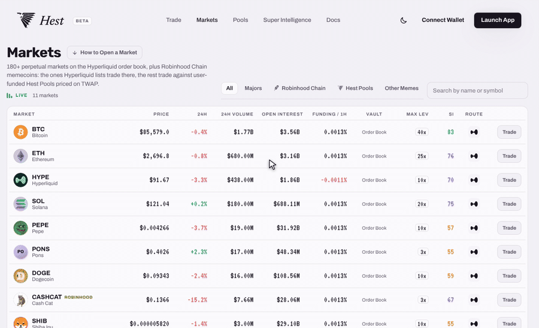

# SI Score

Every market on Hest carries a **Super Intelligence Score** from 0 to 100. Higher is safer. It is shown in the Markets table, on every trade page inside Risk Shield, and in full on the Super Intelligence page.

The score is not one formula for every coin. A memecoin and Bitcoin fail in different ways, so they are read with different instruments.

## Memecoins: On-chain Read (60%) + Social Read (40%)

Applies to Robinhood Chain tokens, on the order book or in a Hest Pool.

**On-chain**

| Factor | What it measures |
| --- | --- |
| Dev wallets | How much supply the deployer and linked wallets still hold, and whether they moved it in the last 7 days. |
| Holder spread | Top-10 concentration versus the long tail. A few wallets owning half the float means a few wallets own the price. |
| Sniper share | Share of supply bought in the first blocks after launch. Snipers sell into every pump. |
| Candle size | The worst 1-hour candle in the last 7 days. This is what Risk Shield compares your liquidation against. |
| Liquidity depth | How much USDC it takes to move the DEX pool 10%. Thin pools make the TWAP easier to push. |

**Social**

| Factor | What it measures |
| --- | --- |
| X activity | Posting cadence of the official account, follower growth, share of engagement that is bots. |
| Team transparency | Doxxed or anonymous, previous projects, whether the dev talks to holders or disappears between pumps. |
| Community sentiment | Tone of replies and mentions in the last 7 days: organic excitement, paid shilling, or holders asking where the dev went. |
| Narrative | What the joke is, whether it travels beyond the first community, whether a fork can steal it. |
| Longevity | Age, holder retention through drawdowns, whether it survived its first 50% dip. |

Each memecoin page also carries **Project notes**: a short written read of the token, the team status and the narrative.

## Majors: Market Read

Applies to BTC, ETH, SOL and every other order book market that is not a Robinhood Chain token. Dev wallets and snipers would score 99 on Bitcoin and tell you nothing, so the score reads the market itself. All five factors are computed live.

| Factor | What it measures |
| --- | --- |
| Funding skew | How far the hourly funding rate sits from neutral. A crowded side pays to stay in, and crowded sides get squeezed. |
| Crowding | Open interest relative to 24h volume. When OI is a multiple of the volume, positions cannot exit without moving the price. |
| Volatility | Today's move plus the worst hour of the week. Calm tape scores high regardless of the coin's reputation. |
| Liquidity depth | 24h volume on the order book. Deep books absorb liquidations; thin ones gap through them. |
| Worst candle | The largest 1-hour drop in the last 7 days. |

## What the Score Is Used For

* **Listing**: pool markets need 45+; under 60 they open at 2x.
* **Leverage caps**: Super Intelligence sets the maximum leverage on Hest Pool markets.
* **Risk Shield**: the worst-candle factor is the number your liquidation distance is tested against.
* **Copilot**: every answer is grounded in the factors behind the score.


The score is information, not advice. A 90 can still drop 30% in a day. It tells you how the market can hurt you, not whether it will go up.

