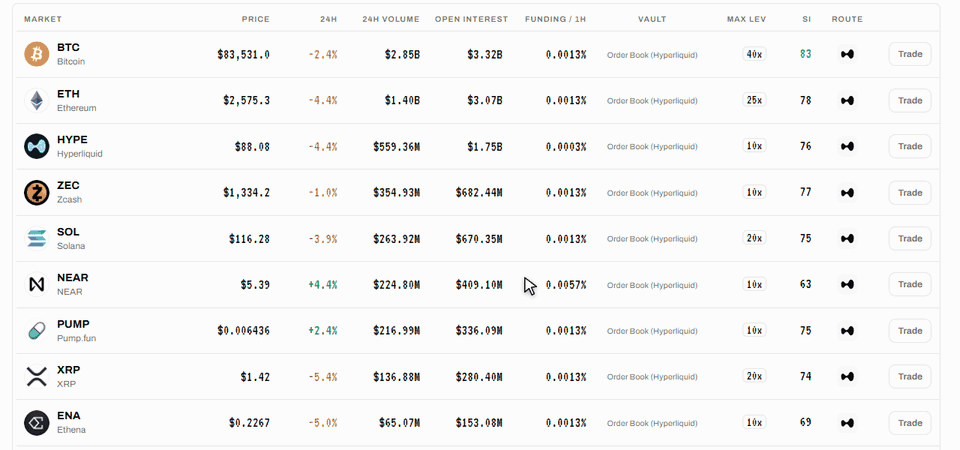

# SI Score

Every market on Hest carries a **Super Intelligence Score** from 0 to 100. **Higher is safer.** It is shown in the **SI** column of the Markets table, inside Risk Shield on every trade page, and in full on the **Super Intelligence** page.

The score answers one question: **how can this market hurt a leveraged position right now?** It does not say whether the price will go up, and it does not rate the project behind a token.

## Grades

| Score     | Grade         | What it means                                                              |
| --------- | ------------- | -------------------------------------------------------------------------- |
| 80 to 100 | **Clean**     | Deep, calm and uncrowded. The market itself is unlikely to be the problem. |
| 60 to 79  | **Fair**      | Liquid and tradable, with at least one weak factor worth watching.         |
| 45 to 59  | **Caution**   | Crowded positioning or a violent week. Liquidations can cascade.           |
| 0 to 44   | **High risk** | The market is stretched. Small moves can do outsized damage.               |

## The Market Read

On Order Book markets the score is computed **live from the market itself**, from five factors. Each factor is scored from 0 to 100, higher is safer, and the SI Score combines them.

| Factor              | Input                                                        | How it scores                                                                                                                                                |
| ------------------- | ------------------------------------------------------------ | ------------------------------------------------------------------------------------------------------------------------------------------------------------ |
| **Funding skew**    | Hyperliquid's hourly funding rate                            | Falls as the rate moves away from zero in either direction. A crowded side pays to stay in, and crowded sides get squeezed.                                  |
| **Crowding**        | Open interest divided by 24h volume                          | Falls as open interest grows relative to volume. When open interest is a multiple of a day's volume, positions cannot all exit without moving the price.     |
| **Volatility**      | Today's price change and the worst 1-hour candle of the week | Falls with both. A calm market scores high regardless of the coin's reputation.                                                                              |
| **Liquidity depth** | 24h traded volume                                            | Rises on a logarithmic scale: every tenfold increase in volume adds the same number of points. Deep markets absorb liquidations; thin ones gap through them. |
| **Worst candle**    | The worst 1-hour candle of the last 7 days                   | Falls as the candle grows. This is the same number Risk Shield uses.                                                                                         |

### The Worst Candle

The worst candle (shown as **Max Wick 7d** in Risk Shield) is read from the market's 1-hour candles over the last 7 days. For each candle Hest takes the larger of:

* the drop from open to low, as a share of the open, and
* the full range from high to low, as a share of the high,

and keeps the largest value across the week, rounded to 0.1%. For Order Book markets the candles come from Hyperliquid; for Hest Pools markets they come from the pool's own hourly price history. The value is refreshed every 10 minutes.

### Data and Refresh

Funding, open interest, volume and price change come from Hyperliquid's market data, refreshed every 10 seconds. The score is recomputed whenever that data or the worst candle changes.

## The Super Intelligence Page

Open **Super Intelligence** in the top menu and pick a market. The page shows:

* the SI Score with its grade and the market's maximum leverage;
* a **Score Breakdown** with each factor as its own bar, and the worst 1-hour candle of the week;
* **What the Score Watches**, a plain description of every factor;
* the **SI Brief**, a short written read of the market (see below);
* [Copilot](copilot.md), to ask about the market.

### The SI Brief

The SI Brief is a three-sentence read of the market for a leveraged trader: crowding and funding, how violent the week was, and how much leverage the market can take. It is written from the same live numbers as the score, and one brief per market is shared by every visitor. It is rewritten when the price has moved 3% or more, when funding changes sign, or after an hour, whichever comes first. If no brief is available, the page shows a short read derived from the score.

## What the Score Is Used For

* **Reading a market at a glance** in the Markets table and on the trade page.
* **Risk Shield:** the worst-candle number is what your liquidation distance is tested against. See [Risk Shield](risk-shield.md).
* **Copilot:** answers are grounded in the same numbers.


The score is information, not advice. A market with a high score can still drop sharply in a day. It tells you how the market can hurt you, not where the price goes next.

